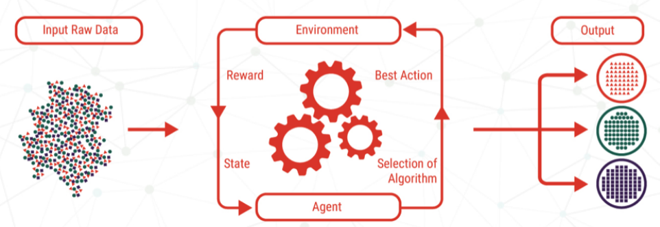

# Age, Gender, Ethnic CNN

        -> GPU
        -> numpy
        -> pandas 
        -> matplotlib
        -> seaborn
        -> tensorflow
        -> keras 
How:
-
Please open on kaggle on local machine 

Contents:
-
age_gender.csv
https://www.kaggle.com/nipunarora8/age-gender-and-ethnicity-face-data-csv

The dataset includes 27305 rows and 5 columns.

We're going to make these three predictions:
-
        -> Age prediction
        -> Gender prediction
        -> Ethnicity prediction
        
        
What is Convolutional Neural Networks?
-

